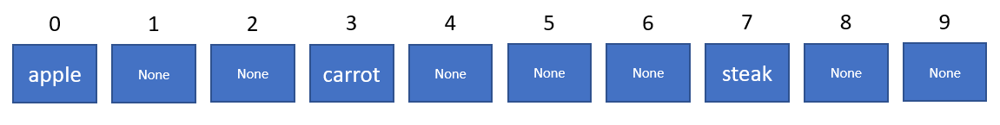

# Project 4: Hash Tables
**Due: Thursday, March 23rd @ 9:00 PM ET**
**Please note that March 23rd is an informal deadline , which means we will be releasing the next project. In order to prevent a potential backlog for our students I applied the following:**

**Your project remains open until March 30th. To give additional time to students who may need it.**

**After March 30th 9:20 pm project closes.**


_This is not a team project. Do not copy someone else’s work._

## Assignment Overview

Hash Tables are a very powerful data structure that are best known for their ability to insert, delete, and lookup in expected run time of O(1) time. This allows them to be very powerful in storing data that needs to be accessed quickly.



A lot of you may already be familiar with the concept of hash tables, as they are implemented in Python as dictionaries and C++ as unordered maps.

In this project, you will be implementing a **Hash Table** from scratch in Python and applying it to application problems.

## Assignment Notes

1. Using any of the following will result in the **loss of all testcase and manual points** associated with the violating function.
   1. a Python dictionary or set,
   2. a Python container/collection other than a basic list or tuple, or
   3. the nonlocal keyword
2. Calling magic or protected methods improperly in this project will result in a **2 point deduction for each violation, up to a maximum of 20 points.**

   1. Calling a magic method like \_\_len\_\_() with the syntax `table.__len__()` instead of the proper
      syntax `len(table)` is a violation
   2. Calling a protected method like \_insert() outside of its implementing class, e.g., in the application problem,
      is a violation (use \_\_setitem\_\_() instead)
   3. Read below to learn more about magic methods and protected methods

3. Changing function signatures will result in a **2 point deduction for each violation, up to a maximum of 20 points.**

   1. When working with libraries, open-source codebases, or industry codebases, you will rarely be able to change function signatures, so it's good practice to avoid it now!
   2. Changing function signatures will often cause testcases to fail, too.

4. In this project, you will be implementing and using many of Python's _magic methods_.

   1. Magic methods have two underscores on the front and the back, such as \_\_len\_\_().
   2. In this project, these magic methods won't be doing much, they will call the other protected methods that you
      write!
   3. In other words, these magic methods should not be more than a few lines.
   4. Refer to the syntax table below to see how the magic methods relate to other methods in this project.

5. In this project, you will also be implementing and using _protected methods_.

   1. Protected methods are methods prefaced with a single underscore, such as a function called \_insert().
   2. Protected methods are meant only to be called inside other functions within the class.
   3. This is Python's way of implementing the C++ equivalent of private methods; protected methods meant to be treated
      as private. Protected methods should not be called outside of the implementing class, which means they should not
      be called in the application problem.
   4. Refer to the syntax table below to see how the protected methods relate to other methods in this project.

6. Make sure you split the work between the magic and hidden methods appropriately.

   1. The majority of the testing will take place in the magic method testcases of \_\_setitem\_\_(), \_\_getitem\_\_()
      , and \_\_delitem\_\_() to simulate real-world use.
   2. As shown in the syntax table below, however, the magic methods \_\_setitem\_\_(), \_\_getitem\_\_(), and
      \_\_delitem\_\_() will call the protected methods \_insert(), \_get(), and \_delete(), and these protected
      methods should handle all of the logic associated with insertion, lookup, and deletion.
   3. Use the small testcases for the \_insert(), \_get(), and \_delete() functions to make sure you are dividing the
      work properly.
   4. Magic methods should not be more than a few lines.

7. If you inspect **\_hash_1 and \_hash_2**, you will see that they depend on the size of the string. For the purposes of
   this assignment, treat these as taking O(1) (constant) time.
8. A few guarantees:
   1. Capacity will not grow past ~1000
   2. All keys will be of type string

9. Space complexity is not going to be a consideration in this project. Maps allocate O(N) space in general. We would like to point out that Python's Dictionaries that we all use are space efficient. They are implemented with a space consideration in mind, you can read about how they saved on space using this link, it should be an interesting article for those of you who are interested in saving space [PROOF-OF-CONCEPT FOR A MORE SPACE-EFFICIENT, FASTER-LOOPING DICTIONARY ](https://code.activestate.com/recipes/578375/). In this project, due to load factor restrictions, your program will use O(N) space in add and remove methods.
   We **recommend** that your focus should be on auxiliary (additional) memory usage, as a software engineer, try not to exceed O(N) auxiliary space usage when it comes to Maps(Hash Tables).
   
   The following syntax table shows how protected methods, magic methods, and calls to magic methods relate to each other.
   

| Protected                  | Magic                             | How to Use Magic  |
| -------------------------- | --------------------------------- | ----------------- |
|                            | \_\_len(self)\_\_                 | len(self)         |
| \_insert(self, key, value) | \_\_setitem\_\_(self, key, value) | self[key] = value |
| \_get(self, key)           | \_\_getitem\_\_(self, key)        | self[key]         |
| \_delete(self, key)        | \_\_delitem\_\_(self, key)        | del self[key]     |
|                            | \_\_contains\_\_(self, key)       | key in self       |

## Assignment Specifications

\* Denotes _Expected Run Time Complexity_

#### class HashNode:

_DO NOT MODIFY the following attributes/functions_

- **Attributes**
  - **key: str:** The key of the hash node (this is what is used in
    hashing).
  - **value: T:** Value being held in the node. Note that this may
    be any type, such as a `str`, `int`, `float`, `dict`, or a more
    complex object.
  - **deleted: bool:** Whether or not the node has been deleted.
- **\_\_init\_\_(self, key: str, value: T, deleted: bool = False) -\>None**

  - Constructs a hash node.
  - **key: str:** The key of the hash node.
  - **value: T:** Value being held in the node.
  - **deleted: bool:** Whether or not the node has been deleted.
    Defaults to false.
  - **Returns:** `None`.
  - _Time Complexity: O(1)_

- **\_\_str\_\_(self) -\> str** and **\_\_repr\_\_(self) -\> str**
  - Represents the `Node` as a string.
  - **Returns:** `str` representation of node
  - _Time Complexity: O(1)_
- **\_\_eq\_\_(self, other: HashNode) -\> bool**
  - Compares to see if two hash nodes are equal
  - **other: HashNode:** The HashNode we are comparing against
  - **Returns:** `bool `stating whether or not they are equal
  - _Time Complexity: O(1)_
- **\_\_add\_\_(self, other: T) -\> bool**
  - Adds to the value of the current HashNode
  - **other: T:** The value we are adding to our current value
  - **Returns:** `None`
  - _Time Complexity: O(1)_

#### class HashTable:

_DO NOT MODIFY the following attributes/functions_

- **Attributes** (you may edit the values of attributes but do not remove them)
  - **capacity: int:** Capacity of the hash table.
  - **size: int:** Current number of nodes in the hash table.
  - **table: List:** This is where the actual data for our hash
    table is stored
  - **prime_index: int:** Current index of the prime numbers we are
    using in \_hash_2()
- **primes**
  - This is a list of all the prime numbers, from 2 until 1000, used
    for \_hash_2(). This is a **_class attribute_**, so it is
    **accesed by HashTable.primes, NOT self.primes()!**
- **\_\_init\_\_(self, capacity: int = 8) -\> None**
  - Construct an empty hash table, with the capacity as specified in
    the input
  - capacity: int:
  - **Returns:** `None`.
  - _Time Complexity: O(1)_
- **\_\_str\_\_(self) -\> str and \_\_repr\_\_(self) -\> str**
  - Represents the `HashTable` as a string.
  - **Returns:** `str`.
  - _Time Complexity: O(N)_
- **\_\_eq\_\_(self, other: HashTable) -\> bool**
  - Checks if two HashTables are equal
  - **other: HashTable:** the hashtable we are comparing against
  - **Returns**: `bool `stating whether or not they are equal
  - _Time Complexity: O(N)_
- **\_hash_1(self, key: str) -\> int**
  - The first of the two hash functions used to turn a key into a
    bin number
  - Assume this is O(1) time/space complexity
  - **key: str:** key we are hashing
  - **Returns:** int that is the bin number
  - _Time Complexity: O(1)_ (assume)
- **\_hash_2(self, key: str) -\> int**
  - The second of the two hash functions used to turn a key into a
    bin number. This hash function acts as the tie breaker.
  - Assume this is O(1) time/space complexity
  - **key: str**: key we are hashing
  - **Returns:** int that is the bin number
  - _Time Complexity: O(1)_ (assume)

**_IMPLEMENT the following functions_**

- **\_\_len\_\_(self) -\> int**
  - If you see a function prefixed and suffixed with two underscores, that means it is a magic method and should not be called directly (we will deduct points for using them directly)!!
    For example, this function is called using the Python built-in len() method and not \_\_len\_\_().
  - Getter for the size (that is, the number of elements) in the
    HashTable
  - This function should be one line!
  - _Time Complexity: O(1)_
  - **Returns:** int that is size of hash table
- **\_\_setitem\_\_(self, key: str, value: T) -\> None**
  - Sets the value with an associated key in the HashTable
    - **_This should be a short, \~1 line function_**- the
      majority of the work should be done in the \_insert()
      method!
  - _Time Complexity: O(1)_
  - **key: str**: The key we are hashing.
  - **value: T**: The associated value we are storing.
  - **Returns:** None
- **\_\_getitem\_\_(self, key: str) -\> T**
  - Looks up the value with an associated key in the HashTable
    - If the key does not exist in the table, raises a **KeyError**.
    - **_This should be a short, \~3 line function_**- majority of the work should be done in the \_get() method!
  - _Time Complexity: O(1)_
  - **key: str**: The key we are searching.
  - **Returns:** The value associated to the provided key.
- **\_\_delitem\_\_(self, key: str) -\> None**
  - Deletes the value with an associated key in the HashTable
    - If the key does not exist in the table, it raises a **KeyError**
    - **_This should be a short, \~3 line function_**- majority of the work should be done in the \_get() and
      \_delete() methods!
  - _Time Complexity: O(1)_
  - **key: str**: The key we are deleting the associated value of.
  - **Returns:** None
- **\_\_contains\_\_(self, key: str) -\>bool**

  - Determines if a node with the key denoted by the parameter exists in the table
    - **_This should be a short, \~3 line function_**- majority of the work should be done in the \_get() method!
  - _Time Complexity: O(1)_
  - **key: str**: The key we are checking to be a part of the hash table.
  - **Returns:** True if key is in the HashTable, False otherwise

- **\_hash(self, key: str, inserting: bool = False) -\> int**

  - Given a key string, return an index in the hash table.
  - Should implement probing with double hashing.

    - If the key exists in the hash table, return the index of the
      existing HashNode.
    - If the key does not exist in the hash table (i.e. HashNode is None at the key), return the
      index of the next available empty position in the hash
      table.

      - Collision resolution should implement double hashing
        with hash1 as the initial hash and hash2 as the step
        size

    - Note - There are 2 possibilities when hashing for an index:
      - When inserting a node into the hash table we want to
        insert into the next available bin (i.e. HashNode is None or *deleted*).
      - When performing a lookup/deletion in the hash table we
        want to continue until we either find the proper
        HashNode (not *deleted* and matching key) or until we reach a bin that has never held a
        value (a *None* bin). This is to preserve the collision resolution
        methodology.
      - The inserting parameter should be used to differentiate
        between these two cases.

  - _Time Complexity: O(1)_
  - **key: str:** The key being used in our hash function
  - **inserting: bool:** Whether or not we are doing an insertion.
    Important for the reasons described above.
  - **Returns:** int that is the bin we hashed into

- **\_insert(self, key: str, value: T) -\> None**

  - Use the key and value parameters to add a HashNode to the hash
    table. **Requires _grow to work! You should skip down 
    to get that function working if you want to finish this one!**
    - If the key exists, overwrite the existing value
    - In the event that inserting causes the table to have a **load
      factor of 0.5 or greater** you must grow the table to double
      the existing capacity. This should be done in the \_grow method.
    - _Time Complexity: O(1)_
    - **key: str**: The key associated with the value we are storing.
    - **value: T**: The associated value we are storing.
    - **Returns:** None

- **\_get(self, key: str) -\> HashNode**

  - Find the HashNode with the given key in the hash table.

    - If the element does not exist, return None

  - _Time Complexity: O(1)_
  - **key: str**: The key we are looking up.
  - **Returns:** HashNode with the key we looked up.

- **\_delete(self, key: str) -\> None**

  - Removes the HashNode with the given key from the hash table .
    - If the node is found assign its key and value to None, and
      set the deleted flag to True (creating a new HashNode for this is acceptable).
  - _Time Complexity: O(1)_
  - **key: str**: The key of the Node we are looking to delete.
  - **Returns:** None

- **\_grow(self) -\> None**

  - Double the capacity of the existing hash table.
    - Do **NOT** rehash deleted HashNodes
    - Must update self.prime_index, the value of
      self.prime_index should be the **index** of the largest
      prime **smaller** than self.capacity in the HashTable.primes
      tuple.
    - **SHOULD USE _insert! (Yes, they use each other).**
  - _Time Complexity: O(N)_
  - **Returns:** None

- **update(self, pairs: List[Tuple[str, T]] = []) -\> None**

  - Updates the hash table using an iterable of key value pairs
    - If the value already exists, update it, otherwise enter it
      into the table
    - **Also requires _insert to work!**
  - _Time Complexity: O(M), where M is length of pairs_
  - **pairs:** **List[Tuple[str, T]]**: list of tuples (key,
    value) being updated
  - **Returns:** None

- **keys(self) -\> List[str]**

  - Makes a list that contains all of the keys in the table
    - Order does not matter!
    - This function, values, and items should be *very* similar.
    - Be sure to exclude nonexistent (None) HashNodes and deleted HashNodes in this function, as well as in values and items!
  - _Time Complexity: O(N)_
  - **Returns:** List of the keys

- **values(self) -\> List[T]**

  - Makes a list that contains all of the values in the table
    - Order does not matter!
  - _Time Complexity: O(N)_
  - **Returns:** List of the values

- **items(self) -\> List[Tuple[str,T]]**

  - Makes a list that contains all of the key value pairs in the table
    - Order does not matter!
  - _Time Complexity: O(N)_
  - **Returns:** List of Tuples of the form (key, value)

- **clear(self) -\> None**
  - Should clear the table of HashNodes completely (as if they were never even there, not deleted), in essence a
    reset of the table
    - Should not modify capacity
    - We recommend O(1) auxiliary space usage in this function
  - _Time Complexity: O(N)_
  - **Returns:** None

## Application: Image Duplicates


**Important: The use of sort() or any sorting method is prohibited for this problem.**

Congratulations! You have just been hired full-time as an application developer consultant for Dream Company LLC! For your first task, the client has requested that you create an app that detects and displays information about duplicate images in a folder! The goal of this app is

- to tell users which images they should keep (the earliest image in the set of the duplicates).
- It should also tell users which images are duplicates of the images they should keep, i.e. the ones they should delete.

You smile to yourself, since you know that your trusty HashTable is perfect for detecting duplicates. Like many objects, images can be hashed (this is explained below), so you need only populate
a HashTable, and while populating check if the image is already in the HashTable to detect a duplicate.
However, there is an added twist: **Rotated (by a factor of 90 degrees) versions of other images also count as duplicates!** This certainly complicates things. Luckily, your coworker has already done a great deal of work for you.
They have used Python's [imagehash](https://pypi.org/project/ImageHash/) library, among other things, to produce the following data from each image for you to use:

1. The set of 4 unique string hashes produced by the image when rotated 0, 90, 180, and 270 degrees. **Rotated versions of images will share hashes, but in a different (shifted right) order!**
2. The corresponding filename of the image to which these hashes belong.

Your job is to take this data and output information about the duplicates into a HashTable.

The keys of this HashTable should be the filenames of the first (when iterating over the input lists) appearances of unique images.

The values of these keys should be the list of filenames of any duplicates (this includes rotated versions) in the order they appeared.

**Examples**

_Note that we have included an Images folder. Inside contains the folders of images
corresponding to each test case by number. Use them however you like._

Example 1

Here is what the folder looks like:


And here is the test case:

There are no duplicates here, so the value lists are empty, implying that we should keep all images. Notice how the hashes in the two lists in data differ completely.

```
data = [['b0c71acc47b33a3c', 'd4a6875833a46eb3', 'e56d4e6612196b96', '810dd2f26e0f3b39'],
        ['cc4e23b330b32773', '943e2de2c03f33cc', '99e67639651a5299', 'c1947948d5976766']]
filenames = ['c02.jpg', 'd01.jpg']
expected = [('c02.jpg', []), ('d01.jpg', [])]  # HashTable should look like {'c02.jpg' : [], 'd01.jpg' : []}
actual = sorted(display_duplicates(data, filenames).items())  # This is how we will convert your HashTable into a list of tuples, so make sure .items() works!
self.assertEqual(expected, actual)  # should pass
```

Example 2

Here is what the folder looks like:


And here is the test case:

Rotated versions count as duplicates!
Notice how the hashes in the two lists are identical, but the second list is the first list shifted right by 2.
From the expected result, we can see that we should keep d04_0.jpg and that d04_180.jpg is a duplicate of d04_0.jpg (not the other way around because d04_0.jpg appears first in the filenames and data lists).

```
data = [['e7d7c78889189b07', 'ba1f80bb1e1e6155', 'b0fc9222dcb2dcac', 'af95d4104bb434be'],
        ['b0fc9222dcb2dcac', 'af95d4104bb434be', 'e7d7c78889189b07', 'ba1f80bb1e1e6155']]
filenames = ['d04_0.jpg', 'd04_180.jpg']
expected = [('d04_0.jpg', ['d04_180.jpg'])]  # HashTable should look like {'d04_0.jpg' : ['d04_180.jpg']}
actual = sorted(display_duplicates(data, filenames).items())
self.assertEqual(expected, actual)
```

Example 3

Here is what the folder looks like:


And here is the test case:

Notice how multiple duplicates appear as additional elements in the value list for the appropriate key in the order they appeared in the filenames/data lists.

```
data = [['9705695a7a587d58', '80c93a703f3f981f', 'c2af34e02ff229b2', 'd562634a4a95cdb5'],
        ['c2af34e02ff229b2', 'd562634a4a95cdb5', '9705695a7a587d58', '80c93a703f3f981f'],
        ['94ef11d91f0f07e0', 'd1ae43475e317e81', 'c16546734aa57a6b', '842656ed0b9b3b2b'],
        ['c16546734aa57a6b', '842656ed0b9b3b2b', '94ef11d91f0f07e0', 'd1ae43475e317e81'],
        ['94ef11d91f0f07e0', 'd1ae43475e317e81', 'c16546734aa57a6b', '842656ed0b9b3b2b'],
        ['842656ed0b9b3b2b', '94ef11d91f0f07e0', 'd1ae43475e317e81', 'c16546734aa57a6b'],
        ['d1ae43475e317e81', 'c16546734aa57a6b', '842656ed0b9b3b2b', '94ef11d91f0f07e0']]
filenames = ['c04_0.jpg', 'c04_180.jpg', 'd02_0.jpg', 'd02_0_180.jpg',
             'd02_0_d.jpg', 'd02_270.jpg', 'd02_90.jpg']
expected = [('c04_0.jpg', ['c04_180.jpg']),
            ('d02_0.jpg', ['d02_0_180.jpg', 'd02_0_d.jpg', 'd02_270.jpg', 'd02_90.jpg'])]
actual = sorted(display_duplicates(data, filenames).items())
self.assertEqual(expected, actual)
```

- **display_duplicates(data: List[List[str]], filenames: List[str]) -> HashTable:**
  - Displays duplicate images represented by a HashTable in the following format ( {key : value} ):
    {first unique instance of image filename : [List of duplicate image filenames of that first instance]}.
    If done correctly:
    1. The keys of the HashTable should be the filenames of the images we want to keep,
       i.e. the earliest (leftmost in filenames list) occurrences of images which are all unique.
    2. The values lists should be empty if that image has no duplicates. Otherwise, they should contain the filename(s) of the duplicate images to the first occurrence of that image, the corresponding key IN ORDER OF APPEARANCE.
    3. Each filename appears exactly once, as either a key or a member of a value list, but never both.
  - The first filename corresponds the first list in data, the second to the second, etc.
  - Guaranteed that len(data) = len(filenames), since their indices correspond to associated data.
  - The test cases require the items function you wrote to work!
  - _Time Complexity: O(N), N is number of images (N = len(data) = len(filenames))_
  - **data: List[List[str]]**: List of lists of four hash strings corresponding to the hash results for each
    image rotated 0, 90, 180, and 270 degrees
  - **filenames: List[str]:** The corresponding filenames of the images whose hash info lies in data.
  - **Returns:** HashTable detailing image duplicate information as described above.

After finishing the display_duplicates function, you are contacted by Big Hit Music (The label that own BTS!). They are 
impressed with your HashTable skills and would now like to commission you to make an algorithm that helps them 
generate new fan chants for the ARMY (BTS Fan Group Name).


This algorithm will take a string that represents a possible fan chant. In addition, this function will also 
take a list of strings that represents the words that we want to find within the fan chant. So, for example, the fan 
chant string could be "lovehopeloveBTSforeverBTShope" and the list of strings could be ["love", "hope"]. Your function 
should output the starting index location of any permutation of the words in the list of strings. So, for this example, 
the permutations would be "lovehope" and "hopelove", and the function would return [0, 4].

- **generate_fan_chant(fan_chant: str, chant_words: List[str]) -> List[int]:**
  -  A function that finds all the index positions where permutations of chant_words are in the fan chant. 
  - **Time Complexity: O(K * W * N), N is the length of the fan_chant parameter, K is the number of elements within chant_words, and W is the length of the words within chant_words.**
  - **Space Complexity: O(K), K is the number of elements in the chant_words list.**
  - **fan_chant: str**: A string that represents the BTS fan chant
  - **chant_words: List[str]:** A list of strings that represents the words we want to find in the fan chant
  - **Returns:** A list of ints that contains the starting index of any permutation of the words within the fan chant
  - **All the words within chant_words will be the same length**
  
```
        fan_chant = "lovehopeloveBTSforeverBTShope"
        chant_words = ["love", "hope"]
        output = generate_fan_chant(fan_chant, chant_words)
        # output should be [0, 4]
        
        Explanation: The first location where there is a permutation of the chant_words is index 0, 
        this is because it is where the start of the permutation "lovehope" is. The second location where 
        there is a permutation is index 4. This is because it is where the start of the permutation 
        "hopelove" is. 
```

```
        fan_chant = "lovehopeBTS!loveBTS!foreverBTS!love"
        chant_words = ["love", "BTS!"]
        output = generate_fan_chant(fan_chant, chant_words)
        # output should be [8, 12, 27]
        
        Explanation: The index location 8 corresponds to the start of the permutation "BTS!love" in 
        the fan chant string. For 12, it corresponds to "loveBTS!", and for 27, it corresponds to 
        "BTS!love". 
```

```
        fan_chant = "lovehopeloveBTS!foreverBTS!hope"
        chant_words = ["BTS!", "hope"]
        output = generate_fan_chant(fan_chant, chant_words)
        # output should be [23]
        
        Explanation: There is only one location where a permutation of the chant words exists,
        and that is at index 23, and it corresponds to the start of the permutation "BTS!hope".
```

REMEMBER THAT HASHTABLE VALUES CAN BE ANY TYPE\
**_Use of \_hash(), \_insert(), \_delete(), \_get(), and \_grow() is STRICTLY
FORBIDDEN in the application!!! Use magic methods instead i.e. pretend your HashTable is a Python dictionary. :)_**

Authors of this project are: Adam Kasumovic and Nate Gu.

## **Submission**

#### **Deliverables**

In every project you will be given a file named as "**solution.py**". You will work on this file to write your Python code.
We recommend that you **download your "solution.py" and "tests.py" to your local drive**, and work on your project using PyCharm so you can easily debug your code.

Below are the simple steps to work on any project locally in your personal computer in this class:

**APPROACH 1: USING D2L TO DOWNLOAD PROJECT'S STARTER PACKAGE:**

1. Make sure you installed PyCharm
2. You can download the starter package from D2L under Projects content. Watch the short tutorial video on how to download the starter package from D2L and open it up in PyCharm.
3. Work on your project as long as you want then upload your solution.py , (watch the short tutorial video on D2L for uploading your solution.py), and upload your solution.py to Codio.
4. Click Submit button on Guide when you are done!
    <!--- I couldn't find these on the repo. -->

**APPROACH 2: USING CODIO TO DOWNLOAD solution.py and tests.py**

1. On your own computer make sure to create a local folder in your local drive, name it something like **ProjectXX**, replace xx with the actual project number, in this case your folder name would be **Project04**.
2. **Download** solution.py from Codio by simply right mouse clicking on the file tree, see image below
   
3. **Download** tests.py from Codio by simply right mouse clicking on the file tree as shown above.
4. Work locally using PyCharm as long as you need.
5. When finished with your solution.py file, upload your file to Codio by right mouse clicking on the Project Directory on file tree.You should rename or remove the solution.py file that is currently existing in Codio before you upload your completed version.
6. Go To Guide and click Submit button
   

**It does not matter which approach you choose to work on your project, just be sure to upload your solution, “solution.py”, to Codio and click on the Submit button by its deadline.**
Working locally is recommended so you can learn debugging. You can complete your entire solution.py using Codio editor, debugging may not be as intuitive as PyCharm IDE. For this reason we recommend that you work locally as long as you need, then upload your code to Codio.

**Grading**

- **As a reminder, any use of the built-in Python sort function in any function of this project will result in a deduction of ALL THE POINTS of the function.**

- **Auto Graded Tests (70 points)** see below for the point distribution for the auto graded tests:

  * 00 - test_hash: \_\_/8
  * 01 - test_insert: \_\_/8
  * 02 - test_get: \_\_/4
  * 03 - test_delete: \_\_/4
  * 04 - test_len: \_\_/1
  * 05 - test_grow: \_\_/1
  * 06 - test_setitem: \_\_/1
  * 07 - test_getitem: \_\_/1
  * 08 - test_delitem: \_\_/2
  * 09 - test_contains: \_\_/2
  * 10 - test_update: \_\_/2
  * 11 - test_keys_values_items: \_\_/2
  * 12 - test_clear: \_\_/2
  * 13 - test_setitem_and_delitem: \_\_/2
  * 14 - test_display_duplicates: \_\_/15
  * 15 - test_generate_fan_chants: \_\_/15

- **Manual (30 points)**

  - Time and Space complexity points are **divided equally** for each function. If you fail to meet time **or** space complexity in a given function, you receive half of the manual points for that function.
  - Loss of 1 point per missing docstring (max 5 point loss)
  - Loss of 2 points per changed function signature (max 20 point loss)
  - Loss of complexity and loss of testcase points for the required functions in this project. You may not use any additional data structures such as dictionaries, and sets!
  * M0 - len: \_\_/1
  * M1 - hash: \_\_/2
  * M2 - setitem: \_\_/1
  * M3 - getitem: \_\_/1
  * M4 - delitem: \_\_/1
  * M5 - contains: \_\_/1
  * M6 - grow: \_\_/2
  * M7 - update: \_\_/2
  * M8 - insert: \_\_/3
  * M9 - keys/values/items: \_\_/2
  * M10 - clear: \_\_/2
  * M11 - display_duplicates time/space: \_\_/5
  * M12 - generate_fan_chants: time/space: \_\_/5
  * M13 - feedback & citation: \_\_/2

- **Important reminder**:
  Note students can not use Chegg or similar sites, see syllabus for details, use of outside resources for the application problem is strictly forbidden, use of outside resources is limited to max of 2 functions in a project.

- **DOCSTRING** is not provided for this project. Please use Project 1 as a template for your DOCSTRING.
  To learn more on what is a DOCSTRING visit the following website: [What is Docstring?](https://peps.python.org/pep-0257/)
  _ One point per function that misses DOCSTRING.
  _ Up to 5 points of deductions

