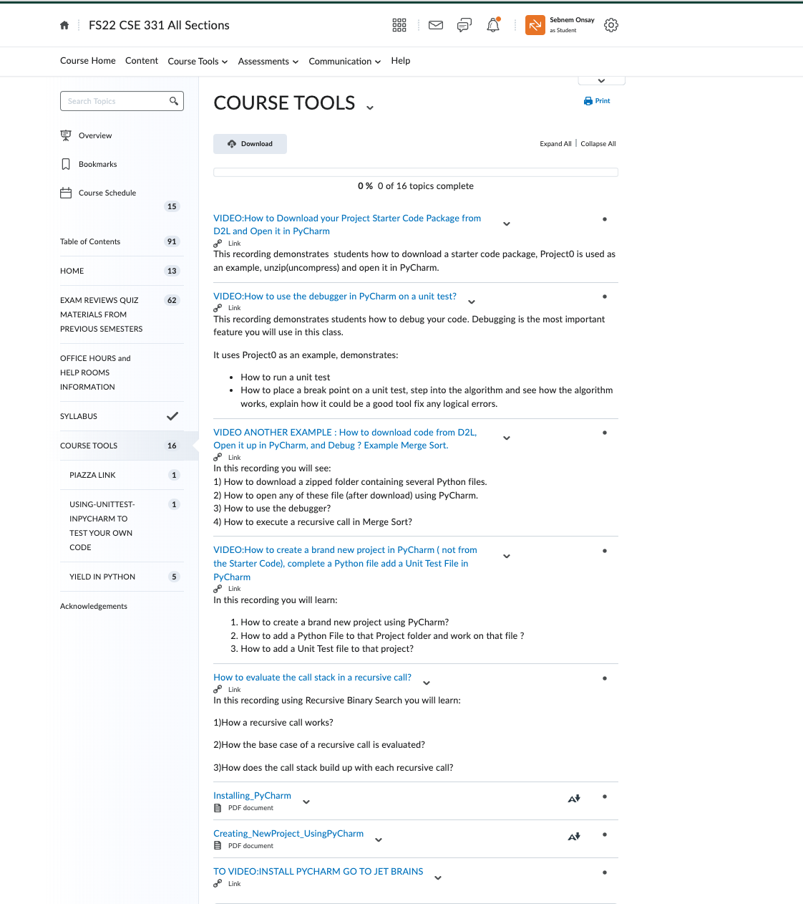
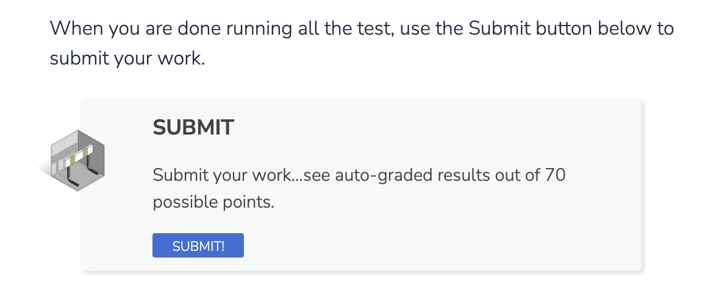
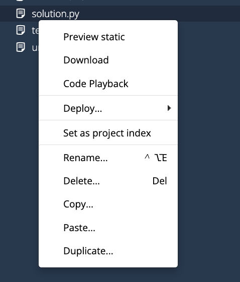
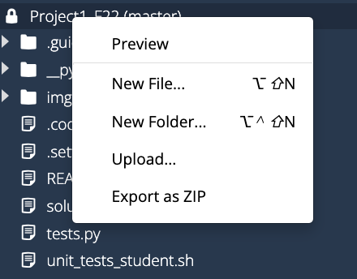

# Project 1: Singly Linked List - Iterative
**Due: Thursday, January 26th at 9:00 PM ET**

_This is not a team project, do not copy someone else’s work._

Assignment Overview
-------------------

A **Singly Linked List** **(SLL)** is a linear collection of elements whose order is given by references stored in each element (also known as **nodes**). 
Below is a Singly Linked List with Head Reference.

This project will explore implementing a singly linked list using iterative methods.
The Singly linked list in this project contains reference to Head and Tail nodes. This project is considered as a review project as many of you are already familiar with Singly and Doubly Linked lists from your previous programming classes CSE 231, 232 or equivalent.

Elements in linked lists are not stored contiguously (in one block) in memory. This enables much faster insertion and deletion (especially at the front) than is available for typical arrays and makes linked lists ideal for implementing other structures such as queues or deques (pronounced 'deck'). In some cases, large datasets may outgrow what is continuously available at a given time, making the use of standard arrays impossible.

This non-contiguous memory allocation comes with a price, however: linked lists are unable to take advantage of indexing, and elements are only accessible by traversing the list until they are found.

**For more information on go to zyBooks Chapter 20, it contains an excellent review, for this data structure. **

* Time complexity accounts for 30% of the points on Project 1. Be sure to review the rubric and adhere to complexity requirements!
* Docstrings (the multi-line comments beneath each function header) are provided in Project 1 to serve as an example for future reference. In future projects, docstrings will **not** be provided, and *must* be completed for full credit.
* Testcases are your friends: before asking about what the form of input/output is or what happens in a particular edge case, check to see if the testcases answer your question for you. By showing the expected output in response to each input, they supplement the specs provided here.
* Don't be afraid to debug your code using PyCharm. Here are few useful short videos posted for you on D2L to learn how to debug while unit testing.
* [See Example 1 Using PyCharm debugger demonstrating on Project 0](https://youtu.be/TDGLfIDPWUQ)
* [See Example 2 Using PyCharm debugger demonstrating on Merge Sort](https://mediaspace.msu.edu/media/Download+-Debug-Run-Recursive+Algorithm+such+as+Merge+Sort/1_eadriksh): it will help you figure out where you're going wrong far more quickly than ad-hoc print statements!
For more information on how to debug your code using PyCharm please go to D2L, under Course Tools, you will find very useful tutorial videos under this module.

* We **strongly** discourage you from calling `remove` in `remove_all`. Why? It's very inefficient to repeatedly call `remove` as each call to `remove` begins searching at the beginning of the list. In the worst case, this will lead our function to operate with O(n^2) time complexity, **violating the required time complexity.**
* In the testcases for this project, you will notice the use of `assertEqual` and `assertIs`. What's the difference? It ties back to the difference between `==` and `is` in Python. The double-equal sign compares _values_ in Python, while the `is` operator compares _memory addresses_ in Python. Put simply, the `is` keyword is stronger than `==`: if two objects are at the same memory address, they must contain the same value. However, it is possible for two objects _not_ at the same memory address to have the same value. In other words, if `a is b` then we know `a == b` as well, but if `a == b` we cannot conclude `a is b`. A great read on the subject is [available here](https://realpython.com/courses/python-is-identity-vs-equality/).
* A few restrictions:
    *   **All of your functions must be iterative.** You will lose **all** points related to the function if it uses recursion! 
    *   **Do not use additional data structures**, such as lists or strings, unless specified otherwise (e.g. `to_string`). You will lose **all** points relating to the function if you do.
    *   In addition to the Codio testing, you will also be graded on the **time** complexity of your functions. Take note of the time complexity requirement for each function.
    *   **No hardcoding testcases**. If you do this, you will lose **all** points for that function.

    

Assignment Specifications
-------------------------

### **class SLLNode:**

_**Do not** **modify** this class_

*   **Attributes:**
    *   **value:** Value stored in a Node
    *   **next:** Reference to the following Node (May be None)
*   **init(self, value: T, next: Node = None) -> None:**
    *   This function initializes a node with a given value and next reference, pointing to the next Node in the list.
    *   self.value - the value of the Node.
    *   self.next - the next Node in the list, default value is None
*   **repr(self) -> str:**
    *   A node is represented in string form as ‘value’.
*   **str(self) -> str:**
    *   A node is represented in string form as ‘value’. Use str(node) to make it a string.
*   **eq(self, other: Node) -> bool:**
    *   This function compares two Nodes.
    *   other - the right-hand operand of the “==”
    *   Returns either True or False

### **class SinglyLinkedList:**

_**Do not modify** the following attributes/methods_

*   **Attributes:**
    * **head:** The first Node in the linked list (May be None)
    * **tail:** The last Node in the linked list (May be None)
*   **init(self) -> None:**
    *   This function initializes a SinglyLinkedList
*   **repr(self) -> str:**
    *   A string representation of the list.
    *   For this to work, you must have completed `to_string`
*   **eq(self, other: SLL) -> bool:**
    *   This function compares two SinglyLinkedLists.
    *   other - the right-hand operand of the “==”
    *   Returns either True or False

You must implement the following functions in **solution.py**. Take note of the specified return values, input parameters, and time complexity requirements. **Do not change the function signatures.**

*   **push(self, value: T) -> None:**
    * Insert the given **value** into the linked list
    * The value should be inserted at the end of the list
    * NOTE: You must get this function to work in order to do the rest of the project!!!
    * Time complexity: _O(n)_
*   **to\_string(self) -> str:**
    *   Generate and return a string representation of the list
    *   The values should be separated by a “ --> “ (a space followed by two hyphens, a greater than symbol, and then another space)
        *   Make sure to avoid a trailing " --> "!
    *   Return the string "None" if there are no nodes in the list.
    *   **You are allowed to use strings in this function.**
    *   Time complexity: _O(n)_, assuming string concatenation method is _O(1)_
        * See this [link](https://codereview.stackexchange.com/questions/3972/string-manipulation-complexity/3973#3973) (refers to Java, but the same idea applies in Python) for more information as to why string concatenation is, in general, NOT O(1)
*   **length(self) -> int:**
    *   Determines the number of nodes in the list
    *   If the list is empty, it has a length of 0. 
    *   Time complexity: _O(n)_
*   **sum\_list(self) -> T:**
    *   Calculates and returns the sum of the values in the list, assuming all values in the list are of the same type T
    *   If the list is empty, return None.
    *   Note that this must work with any type T, whether T is an integer, a string, etc. How can you get the starting value of the correct type for your summation?
    *   Time complexity: _O(n), assuming addition operation is O(1)_
*   **remove(self, value: T) -> bool:**
    *   Remove the first node in the list with the given _value_
    *   If the value doesn’t exist, do not change the linked list
    *   Returns a bool indicating if anything was successfully deleted
    *   Time complexity: _O(n)_
*   **remove\_all(self, value: T) -> bool:**
    *   Remove all nodes in the list with the given **value**
    *   If the value doesn’t exist, do not change the linked list
    *   Returns a bool indicating if anything was successfully deleted
    *   Again, it is highly recommended that you avoid calling remove in this function
    *   Time complexity: _O(n)_
*   **search(self, value: T) -> bool:**
    *   Looks for **value** in the list
    *   Returns **True** if the **value** is in the list and **False** if it is not in the list
    *   Time complexity: _O(n)_
*   **count(self, value: T) -> int:**
    *   Counts and returns how many times the given **value** occurs in the list
    *   Time complexity: _O(n)_

**Application Problem:** 
-------------------------

You have recently been promoted to Programmer Second-class at the prestigious _Vogon Computational Institute_. Your mother is quite proud, though your father had always wished you would pursue poetry. Prostetnic Vogon Jeltz has just issued a new security protocol for all sensitive interstellar communications, complete with the appropriate approvals, and after a thorough lamination process (Vogons are notoriously beuractratic). To quote Prostetnic Vogon Jeltz himself, the new cipher which he has devised is "dastardly in the extreme" and "a prime example of the cunning and intellect of the Vogon civilization." As it happens, Prostetnic Vogon Jeltz's "revolutionization of the field of cryptography" is accomplished by taking the _reverse_ of the original message. You have been tasked with writing a program which can "decode" the "encrypted" message, by reversing the singly linked list representing the encrypted message.

To do this, you will implement one function:

*   **show_encrypted(data: SLL) -> None**
    *   Given a linked list **data**, reverse the linked list.
    *   **You may not use any additional data structures other than linked lists in this function - this includes no python lists, dictionaries, and sets!**
    *   Time complexity: _O(n)_

### **Examples:**

**Ex1.**

data = Galaxy --> the --> to --> Guide --> Hitchhiker's --> The

Returns: The --> Hitchhiker's --> Guide --> to --> the --> Galaxy

**Ex2.** 

data = Everything --> and --> Universe --> the --> Life, --> of --> Question --> Ultimate --> the --> to --> answer --> The

Result: The --> answer --> to --> the --> Ultimate --> Question --> of --> Life, --> the --> Universe --> and --> Everything

**Ex3.**

data = Universe --> the --> in --> worst --> third --> the --> is --> poetry --> Vogon

Result: Vogon --> poetry --> is --> the --> third --> worst --> in --> the --> Universe

_A hitchhiker should always have a towel :)_

## **Submission**

#### **Deliverables**
In every project you will be given a file named as "**solution.py**". Your will work on this file to write your Python code.
We recommend that you **download your "solution.py" and "tests.py" to your local drive**, and work on your project using PyCharm so you can easily debug your code.

Below are the simple steps to work on any project locally in your personal computer in this class:

**APPROACH 1: USING D2L TO DOWNLOAD PROJECT'S STARTER PACKAGE:**
1. Make sure you installed PyCharm
2. You can download the starter package from D2L under Projects content. Watch the short tutorial video on how to download the starter package from D2L and open it up in PyCharm.
3. Work on your project as long as you want then upload your solution.py , (watch the short tutorial video on D2L for uploading your solution.py), and upload your solution.py to Codio.

4. **Click Submit button AND MARK YOUR WORK COMPLETE** on Guide when you are done!

**APPROACH 2: USING CODIO TO DOWNLOAD solution.py and tests.py**
1. On your own computer make sure to create a local folder in your local drive, name it something like **ProjectXX**, replace xx with the actual project number.
2. **Download** solution.py from Codio by simply right mouse clicking on the file tree, see image below

3. **Download** tests.py from Codio by simply right mouse clicking on the file tree as shown above.
4. Work locally using PyCharm as long as you need. 
5. When finished with your solution.py file, upload your file to Codio by right mouse clicking on the Project Directory on file tree.You should rename or remove the solution.py file that is currently existing in Codio before you upload your completed version. 
6. Go To Guide and click Submit button, **AND MARK YOUR WORK COMPLETE**

**Regardless of the way you choose to work on your project, just be sure to upload your solution, “solution.py”, to Codio by and click on the Submit button by its deadline.**
Working locally is recommended as it enhances your debugging skills. 
You can complete your entire solution.py using Codio editor, debugging may not as intuitive as PyCharm IDE. For this reason we recommend that you work locally as long as you need, then upload your code to Codio.

**Grading**

* Tests (70 points)
   * 01 - test\_push: \_\_/4
   * 02 - test\_to\_string: \_\_/3
   * 03 - test\_length: \_\_/3
   * 04 - test\_sum\_list: \_\_/4
   * 05 - test\_search: \_\_/10
   * 06 - test\_count: \_\_/10
   * 07 - test\_remove: \_\_/8
   * 08 - test\_remove\_all: \_\_/8
   * 09 - test\show_encrypted: \_\_/20

* **Manual (30 points)**
Manual points are reserved for run time complexity check only for Project 1. In future projects, manual points are reserved for run time and space complexities.
- See the time complexity requirement for each function listed. 
  * Loss of 2 points per changed function signature (max 20 point loss)
 
  * Time  complexity points are **all-or-nothing** for each function. If you fail to meet time in a given function, you do not receive manual points for that function.
  * Loss of 1 point per missing docstring (max 5 point loss)
  * Loss of 2 points per changed function signature (max 20 point loss)
  * Loss of complexity and loss of testcase points for the required functions in this project. **You may not use any additional data structures other than linked lists in this function - this includes no python lists, dictionaries, and sets!**
* Manual Grading
   * M1 - \_push: \_\_/3
   * M2 - \_to\_string: \_\_/2
   * M3 - \_length: \_\_/2
   * M4 - \_sum\_list: \_\_/2
   * M5 - \_search: \_\_/2
   * M6 - \_count: \_\_/2
   * M7 - \_remove: \_\_/3
   * M8 - \_remove\_all: \_\_/4
   * M9 - \show_encrypted: \_\_/8
   * M10 -\_feedback and citation: \_\_/2

   * **Important reminder**
Note students can not use Chegg or similar sites, see syllabus for details, use of outside resources for the application problem is strictly forbidden, use of outside resources is limited to max of 2 functions in a project.

    * **DOCSTRING** is  given for this project. You will use this project as your DOCSTRING guide for future projects.

    To learn more on what is a DOCSTRING visit the following website: [What is Docstring?](https://peps.python.org/pep-0257/)
      * One point per function that misses DOCSTRING.
      * Up to 5 points of deductions
